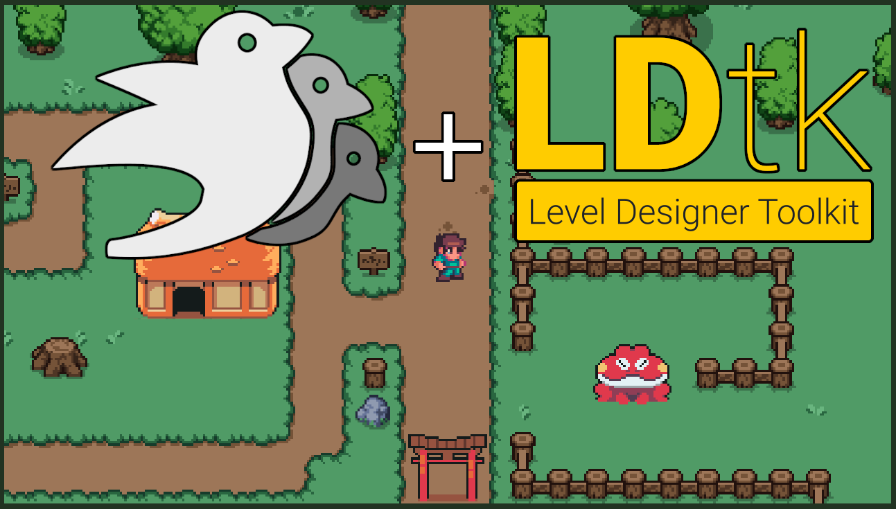

<p align="center">
    
</p>

## [🚀️ Running example on my web](https://radim.xyz/rusty_woods/)

## [📜️ Article on my web](https://radim.xyz/project/rusty_woods/)

# Rusty Woods

A 2D RPG-like groundwork with Bevy and LDtk.

## Usage

### Run

```
cargo run
```

Optional `--release`

It might be necessary to install some system dependencies for bevy on your OS.
See `/workflows/rust-ci.yml` for linux.

### Wasm

```
trunk serve
```

Optional `--release`

This should run as is after you install trunk.

### Spellcheck

```
cspell "*.md" "src/**"
```

Because I talk allot.

# Notes

## TODOs

- animation enhancements
  - patrol

### Optional

- interaction with something in front
- save_game found a good example at:
  <https://github.com/bevyengine/bevy/issues/1442>

bevy game list\
<https://itch.io/search?q=bevy>

## Sprite source

- player gabe - bevy assets
- plains (grass, dirt, higher ground), decor, fences, objects (trees, rocks,
  signs)
  - <https://game-endeavor.itch.io/mystic-woods>
- frog, houses
  - <https://pixel-boy.itch.io/ninja-adventure-asset-pack>
  - This is an amazing asset source. It is full of many free animated sprites
    and tileSets. I highly encourage to use it when playing with this.

## Issues I found workarounds for

To look for real fixes in the future, if someone is looking to build upon this
code.

- Accessing entity_refs outside the current level

  - bevy_ecs_ldtk issue
  - see in `door.rs` under "Known issue"
  - <https://github.com/Trouv/bevy_ecs_ldtk/discussions/113>

- Sprite selection from multiple tiles loads the wrong tiles

  - bevy_ecs_ldtk issue
  - workaround: multi-tile sprites have to be cut out from sprite sheets into
    their own sheet - see `toriiGate.png` from `TilesetHouse.png` or
    `treeBig.png` from `objects.png`
  - <https://github.com/Trouv/bevy_ecs_ldtk/issues/151>
  - still doesn't work in 0.8

- Rules based tiles don't use pivot
  - bevy_ecs_ldtk issue
  - workaround: some ground objects had to be remade as entities
  - <https://github.com/Trouv/bevy_ecs_ldtk/issues/152>

## Ongoing bug after upgrade to 0.11

- After loading a level (entering the hous or going back), the tiles are not
  rendered anymore. Entities are.
  - bevy_ecs_ldtk issue, possibly bevy_ecs_tilemap issue
    https://github.com/StarArawn/bevy_ecs_tilemap/pull/451
